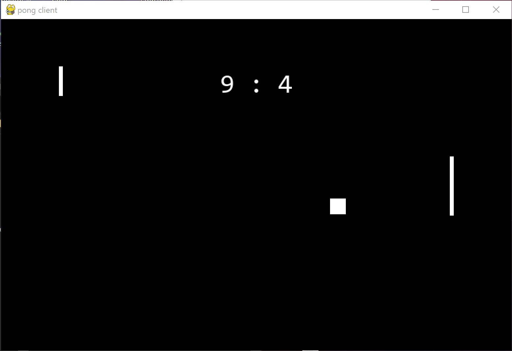

# **This repository is incomplete**
# Pong
Simple, pixel, python 2-player game
## How to download and play
1. Clone repository
```git
C:\your\desired\directory>git clone https://github.com/...
```
2. Install python virtual environment and activate it
```cmd
C:\your\desired\directory>python -m venv venv
C:\your\desired\directory>venv\scripts\activate
```
if something goes wrong, this *might* fix it:
```cmd
C:\your\desired\directory>python3.8 -m venv venv
C:\your\desired\directory>venv\scripts\activate
```
3. Install dependancies
```cmd
(venv) C:\your\desired\directory>pip install -r requirements.txt
```
4. Start server, if you're hosting
```cmd
(venv) C:\your\desired\directory>python server.py
Server initialized !
waiting for connections ...
```
5. Join server, if you're not
```cmd
(venv) C:\your\desired\directory>python client.py
```
In the end, it should look like this:


