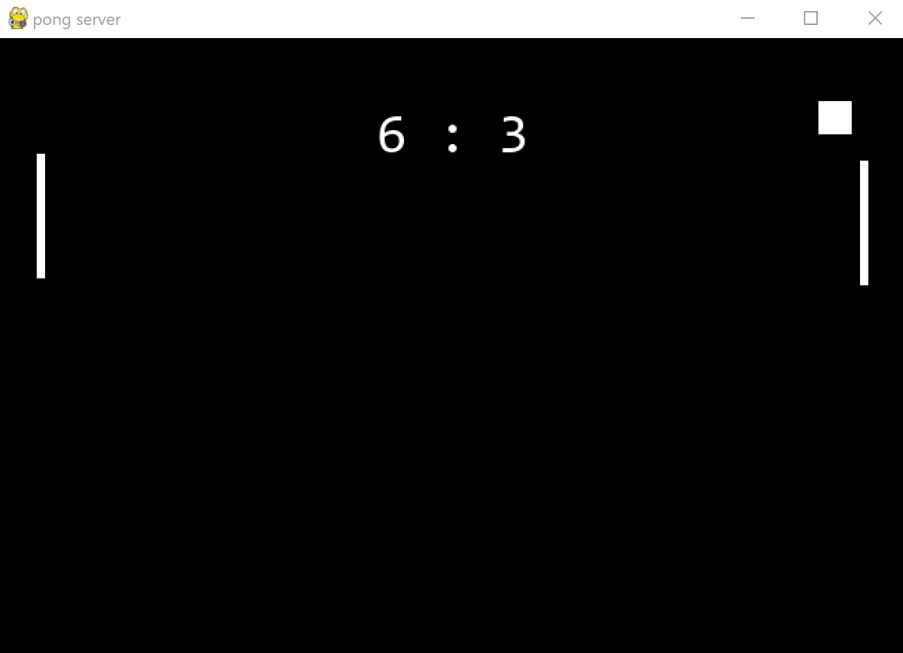

# **Pong**
Simple, pixel, python 2-player game
# How to download and play
1. Clone and enter repository
```
C:\your\desired\directory>git clone https://github.com/UmarZein/pong.git
Cloning into 'pong'...
remote: Enumerating objects: 14, done.
remote: Counting objects: 100% (14/14), done.
remote: Compressing objects: 100% (10/10), done.
remote: Total 14 (delta 4), reused 10 (delta 2), pack-reused 0
Receiving objects: 100% (14/14), 44.07 KiB | 2.32 MiB/s, done.
Resolving deltas: 100% (4/4), done.
C:\your\desired\directory>cd pong
```
2. Install python virtual environment and activate it (everytime you want to run the game, you should activate the virtual environment)
```
C:\your\desired\directory\pong>python -m venv venv
```
If something goes wrong, this might fix it:
```
C:\your\desired\directory\pong>python3.8 -m venv venv
```
Activate the virtual environment
```
C:\your\desired\directory\pong>venv\scripts\activate
```
On linux,
```
$ ~/.../pong source venv/bin/activate
```
3. Install dependencies
```
(venv) C:\your\desired\directory\pong>pip install -r requirements.txt
```
4. Start server, if you're hosting
```
(venv) C:\your\desired\directory\pong>python server.py
pygame 2.0.1 (SDL 2.0.14, Python 3.8.10)
Hello from the pygame community. https://www.pygame.org/contribute.html
port:5555
ip:port = 192.168.0.0:5555
```
5. Join server, if you're not
```
(venv) C:\your\desired\directory\pong>python client.py
pygame 2.0.1 (SDL 2.0.14, Python 3.8.10)
Hello from the pygame community. https://www.pygame.org/contribute.html
ip:port = 192.168.0.0:5555
```
When you're playing the game, it should look like this:



# All-in-one table
| Title | Status | 
| - | - | 
| Number of players | 2 |
| Controllers | Mouse (vertical axis) |
| Python version | Whichever has the dependencies installable | 
| Minimum screen size | 640 × 360 |
| FPS | Modifiable; by default 60 |
| Sounds | None | 
| Open source | True |
| Update plans | None |
| Connection range | LAN |
| IP Privacy | Host will show local IP on run in order to let clients connect sockets |
